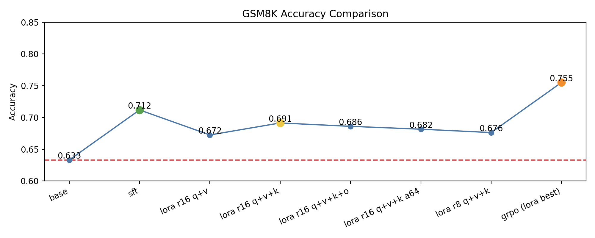

# Qwen2.5 Math Post-train (SFT / LoRA / Prompt / GRPO)

This repo runs PEFT finetuning and GRPO alignment for Qwen2.5.
Primary entrypoint is `run_experiments.py`.

## Layout
- `run_experiments.py`: unified entry for train/infer
- `run_all.sh`: batch script
- `train_full_sft.py` / `train_lora_sft.py` / `train_prompt_sft.py`: SFT trainers
- `train_grpo.py`: GRPO trainer (LoRA adapter required)
- `reward_math.py`: reward/grader utilities
- `eval_gsm8k.py`: GSM8K eval
- `data_gsm8k.py` / `data_math.py`: dataset processing
- `configs/`: yaml configs
- `dataset/`: dataset utilities

## Install
```bash
pip install -r requirements.txt
```

## Training
```bash
python run_experiments.py --task train --mode sft --model 1.5B --dataset gsm8k
python run_experiments.py --task train --mode lora --model 1.5B --dataset gsm8k
python run_experiments.py --task train --mode prompt --model 1.5B --dataset gsm8k
```

## GRPO (LoRA)
GRPO expects a LoRA adapter and trains only LoRA parameters.
```bash
python run_experiments.py --task train --mode grpo --model 1.5B --dataset gsm8k --model-path ./out/lora_math
```

## Inference
```bash
python run_experiments.py --task infer --mode sft --infer-mode basic --model 1.5B --dataset gsm8k --model-path ./out/sft_math
python run_experiments.py --task infer --mode lora --infer-mode basic --model 1.5B --dataset gsm8k --model-path ./out/lora_math
```

## Eval
```bash
python eval_gsm8k.py infer_outputs/base_infer_basic.jsonl
python eval_gsm8k.py infer_outputs/sft_infer.jsonl
python eval_gsm8k.py infer_outputs/lora_infer.jsonl
```

## Results (GSM8K, Qwen2.5-Math-1.5B)
- base: total=1319 correct=835 acc=0.6331 (format_acc=0.7043)
- sft: total=1319 correct=939 acc=0.7119 (format_acc=0.9901)
- lora(r=16, q+v, alpha=32): total=1319 correct=887 acc=0.6725 (format_acc=0.9939)
- lora(r=16, q+v+k, alpha=32): total=1319 correct=912 acc=0.6914 (format_acc=0.9901)
- lora(r=16, q+v+k+o, alpha=32): total=1319 correct=905 acc=0.6861 (format_acc=0.9886)
- lora(r=16, q+v+k, alpha=64): total=1319 correct=899 acc=0.6816 (format_acc=0.9871)
- lora(r=8, q+v+k, alpha=32): total=1319 correct=892 acc=0.6763 (format_acc=0.9886)
- grpo(lora best, kl_coef=0.0): total=1319 correct=996 acc=0.7551 (format_acc=0.9962)


