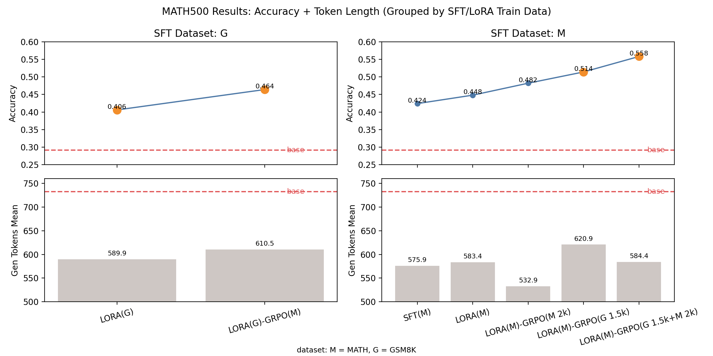

# Qwen2.5 Math Post-train (SFT / LoRA / Prompt / GRPO)

This repo runs PEFT finetuning and GRPO alignment for Qwen2.5.
Primary entrypoint is `run_experiments.py`.

## Layout
- `run_experiments.py`: unified entry for train/infer
- `run_all.sh`: batch script
- `sft/train_full_sft.py` / `sft/train_lora_sft.py` / `sft/train_prompt_sft.py`: SFT trainers
- `rl/train_grpo.py`: GRPO trainer (LoRA adapter required)
- `utils/reward_math.py`: reward/grader utilities
- `evaluation/eval_gsm8k.py`: GSM8K eval
- `data/data_gsm8k.py` / `data/data_math.py`: dataset processing
- `configs/`: yaml configs
- `dataset/`: dataset utilities

## Install
```bash
pip install -r requirements.txt
```

## Training
```bash
python run_experiments.py --task train --mode sft --model 1.5B --dataset gsm8k
python run_experiments.py --task train --mode lora --model 1.5B --dataset gsm8k
python run_experiments.py --task train --mode prompt --model 1.5B --dataset gsm8k
```

## GRPO (LoRA)
GRPO expects a LoRA adapter and trains only LoRA parameters.
```bash
python run_experiments.py --task train --mode grpo --model 1.5B --dataset gsm8k --model-path ./out/lora_math
```

## Inference
```bash
python run_experiments.py --task infer --mode sft --infer-mode basic --model 1.5B --dataset gsm8k --model-path ./out/sft_math
python run_experiments.py --task infer --mode lora --infer-mode basic --model 1.5B --dataset gsm8k --model-path ./out/lora_math
```

## Eval
```bash
python evaluation/eval_gsm8k.py infer_outputs/base_infer_basic.jsonl
python evaluation/eval_gsm8k.py infer_outputs/sft_infer.jsonl
python evaluation/eval_gsm8k.py infer_outputs/lora_infer.jsonl
```

## Results (train dataset: GSM8K, test dataset: GSM8K, base model: Qwen2.5-Math-1.5B)
- base: total=1319 correct=835 acc=0.6331 (format_acc=0.7043)
- sft: total=1319 correct=939 acc=0.7119 (format_acc=0.9901)
- lora(r=16, q+v, alpha=32): total=1319 correct=887 acc=0.6725 (format_acc=0.9939)
- lora(r=16, q+v+k, alpha=32): total=1319 correct=912 acc=0.6914 (format_acc=0.9901)
- lora(r=16, q+v+k+o, alpha=32): total=1319 correct=905 acc=0.6861 (format_acc=0.9886)
- lora(r=16, q+v+k, alpha=64): total=1319 correct=899 acc=0.6816 (format_acc=0.9871)
- lora(r=8, q+v+k, alpha=32): total=1319 correct=892 acc=0.6763 (format_acc=0.9886)
- grpo(lora best, kl_coef=0.0): total=1319 correct=996 acc=0.7551 (format_acc=0.9962)


## Results (train dataset: MATH/GSM8K, test dataset: MATH500, base model: Qwen2.5-Math-1.5B)
- base: total=500 correct=146 acc=0.2920 (format_acc=0.6080, gen_tokens_mean=732.58)
- sft(math): total=500 correct=212 acc=0.4240 (format_acc=0.8960, gen_tokens_mean=575.88)
- lora(gsm8k): total=500 correct=203 acc=0.4060 (format_acc=0.9400, gen_tokens_mean=589.85)
- lora(math): total=500 correct=224 acc=0.4480 (format_acc=0.9320, gen_tokens_mean=583.40)
- lora(gsm8k)-grpo(math): total=500 correct=232 acc=0.4640 (format_acc=0.9200, gen_tokens_mean=610.55)
- lora(math)-grpo(math 2k steps): total=500 correct=241 acc=0.4820 (format_acc=0.9580, gen_tokens_mean=532.87)
- lora(math)-grpo(gsm8k 1.5k steps): total=500 correct=257 acc=0.5140 (format_acc=0.9460, gen_tokens_mean=620.85)
- lora(math)-grpo(gsm8k 1.5k + math 2k steps): total=500 correct=279 acc=0.5580 (format_acc=0.9540, gen_tokens_mean=584.36)


